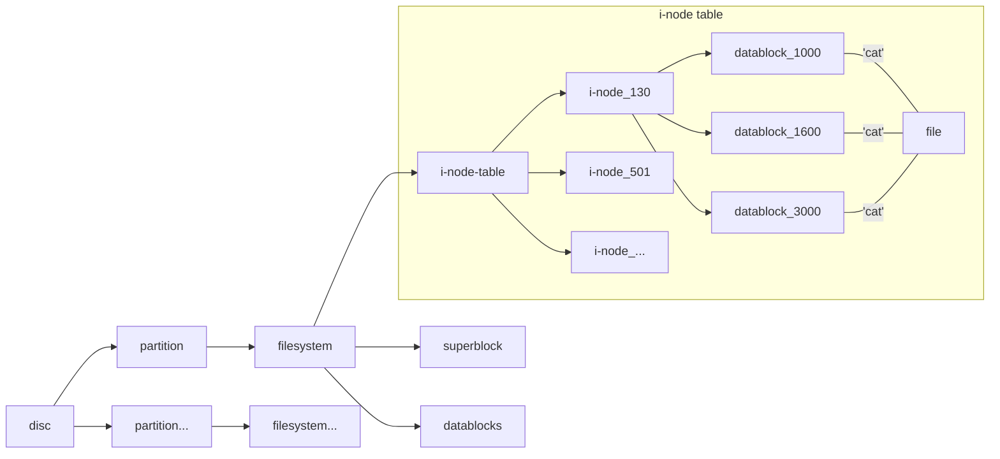

# File

**the numbers above are all made up of course**

### Caution
 - Each i-node has a table which contains 13 blocks
 - Each **Block** indicates a **Data Block** which either stores **data** or **i-nodes**(for large file of course) 
