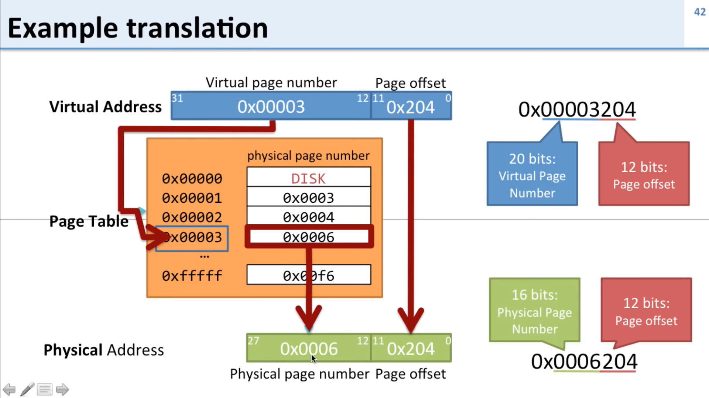

# Paging

### Goals   
- To allow **more processes** to run at lower cost
- To **Protect** the data of the process from being corrupted by one another 
- ...

### Components
- Process
- Process address space
  - Logical address?  --> Virtual address  
- Page Table 
  - Virtual address --> Physical address
- Virtual Memory
  - Pages 
- Random Access Memory
  - Page Frams 

### How ?
Pic from the [video](https://www.youtube.com/watch?v=6neHHkI0Z0o&t=26s)  

### Caution   
- There is a table (Process address space) between **Process** and **Page table**, if Process access Page Table directly, there will be no protection for the data of each memory, since each virtual address in Page table is corresponding to a physical address. 

- **VM**/**RAM** is divided to many **Pages**/**Page frames** - To reduce page table size

- **Page Size** means the size of a Page which stores data (**NOT Entries**)! 

- **Data** in memory are byte addressible, which means each address stores a **byte**. A page whose size is 4096KB implys that there should be 4096K entries for every data (byte), therefore 12 bits for offset is needed.
