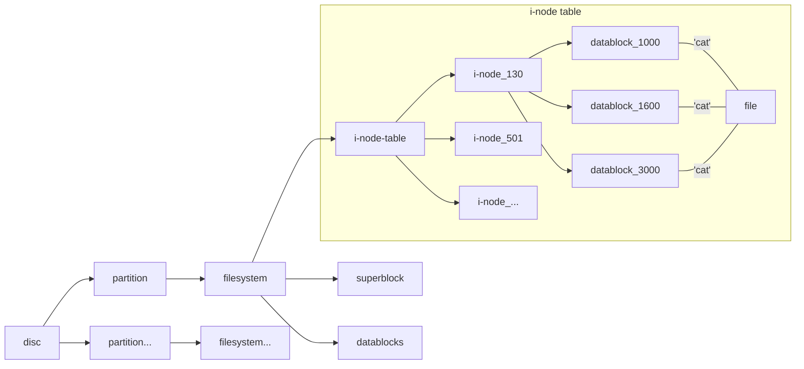

# File

**the numbers above are all made up of course**

### Caution
 - Each i-node has a table which contains 13 blocks
 - Each **Block** indicates a **Data Block** which either stores **data** or **i-nodes**(for large file of course) 

### Link
 - **Soft Link** : Indicates a **file name** (if the name of source flie is changed, the Link is over)
 - **Hard Link** : Indicates a **i-node** (the Link still functions even the source file is deleted) 
=======
- Each i-node has a table which contains 13 blocks
- Each **Block** indicates a **Data Block** which either stores **data** or **i-nodes**(for large file of course) 

### Directory
- **Directory** is a list which contains **file name** and its corresponding **i-node** 

### Links
- **Hard Link** is another reference to the i-node whereas **Soft Link** is a reference to a path.
- Creating **Hard Link** would result the increase of the links number, once drops down0, the actual data of the file will be free. 

### Device
- Each **Device** has its corresponding **Driver**, for example, the system call - read, every time the read is called, the following steps would be proceeded:
	- 1.Kernel would examine the i-node through the file descriptor.
	- 2.Kernel would figure out what kind of the file is (property 'st_mode' in struct 'stat'). 
	- 3.Kernel would instead call the corresponding driver's read funciton to read.
- There are different sets of properties for different kind of files (e.g, buffer for **Disk file**), which can be alter or acquire by function **fcntl()** or **ioctl()** ( fcntl() acts only on **FILES** whereas ioctl() acts on both **FILES** and **DEVICES** ).

