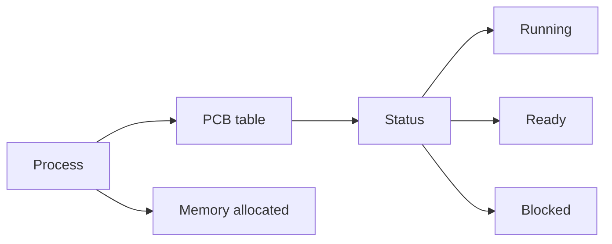
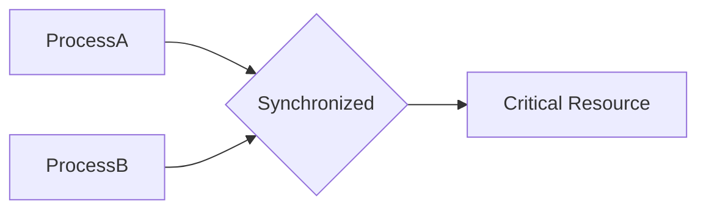

# Process

 - Process is a running program
 - Processes use **Signal** to comunicate
 - Process has a clock (sleep -> kenel set the clock, process paused, wait for the kernel's signal)
	- **sleep()** = alarm() + pause()

#### (In General)

#### Creation of Process
 - TCB table + Memory(Stack, Heap, Data Seg, Code Seg ...)
 - ...
 - Insert The TCB to the queue?

__To keep execution in order  and avoid unexpected behavior__

- WIP

#### (Unix/Linux)
 - Every Process has a **Parent Process**
 - Use **fork()** to create a child process by exactly **copying** the parent process along with **Stack, Data, Heap, Code** etc.
 - **Execve()** tells the process to run another program's code instead of his parent's code.
 - _WIP..._

### Signal
 - **Sigaction()** has **Blocked Signal Set** (sa_mask) whereas **Signal()** does not (A blocked signal handler needs to be inserted into the handler which **Signal** is refering to)
